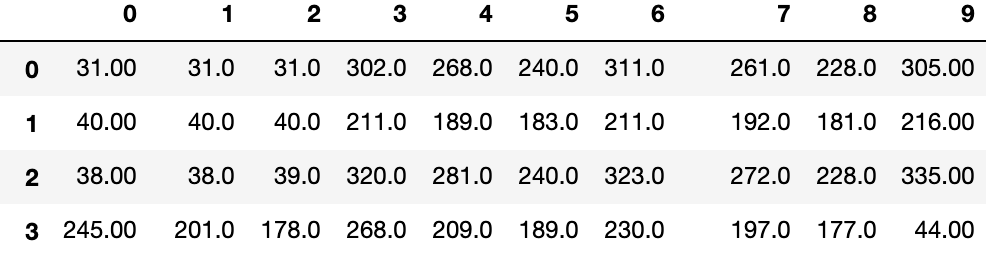

# 数据

在介绍深度学习之前我们先介绍一个更为重要的东西：数据。没有数据我们搭建的深度学习模型只能是一个空架子，那么什么是深度学习中用到的数据呢？

## 数据

所谓数据就是我们通过各种方法获取到的数据，就像你这个月定了多少次外卖，都点了什么，几点定的饭，每次外卖的价格是多少，把以上的信息收集起来就构成了一种关于你的数据集合。

那假如我们把你家附近的房子都卖多少钱收集起来是不是就能预测你家附近的房子价格了呢？显然是不够的，我们还要知道这个房子为什么能卖这么多钱，像这个房子是不是挨着街道，房子面积多大啊，格局怎么样，采光好不好等。

如果我们能把这些信息收集起来，自己做一个表格，此时有一个房子的一些信息，但是不知道价格多少，我们通过与这个表格对照，好像就可以大概估计出这个房子的价格了。但是这样做好像很麻烦，显然是很耗费人力，人工智能就可以帮助我们解决这个问题，我们把收集到的房子信息送到设计好的模型中，然后模型就可以根据自己内部的一个“表格“来预测价格。

此时我们把输入的数据叫做模型的输入，像面积多少，采光好不好这些信息我们称其为特征。类似于下图这种形式。

